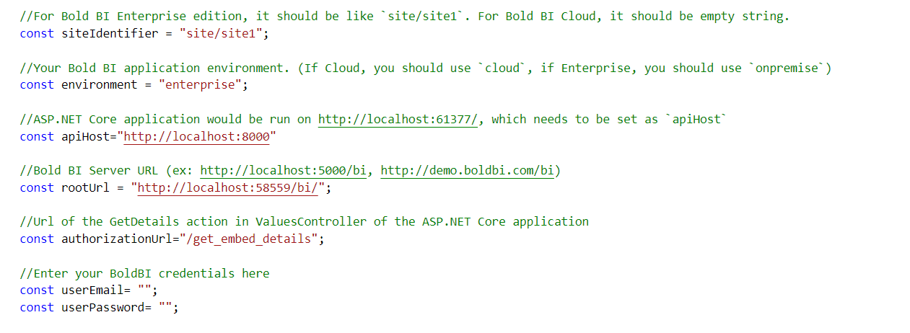

# BoldBI Embedding React with Python Sample

This project was created using React with Python. This application aims to demonstrate how to render the dashboard available on your Bold BI server.

## Dashboard view

   

## Prerequisites

The samples require the following to run.

 * [Python installer](https://www.python.org/downloads/)
 * [Visual Studio Code](https://code.visualstudio.com/download)
 * [Python extension in VS code](https://marketplace.visualstudio.com/items?itemName=ms-python.python)

### Help link

* <https://help.boldbi.com/embedded-bi/faq/where-can-i-find-the-product-version/?utm_source=github&utm_medium=backlinks>

#### Supported browsers
  
* Google Chrome, Microsoft Edge, Mozilla Firefox, and Safari.

## Developer IDE

* Visual studio code(<https://code.visualstudio.com/download>)

### Run a Sample Using Visual Studio Code

 1. The React application acts as a client, and the Python application acts as a server. In the `models.py` file of the Python application, you need to set the User Email and Embed Secret properties.

    <meta charset="utf-8"/>
    <table>
    <tbody>
        <tr>
            <td align="left">UserEmail</td>
            <td align="left">UserEmail of the Admin in your Bold BI, which would be used to get the dashboard list.</td>
        </tr>
        <tr>
            <td align="left">User Password</td>
            <td align="left">Password of the Admin in Bold BI, which will be used to get the dashboards list.</td>
        </tr>
    </tbody>
    </table>

 2. Once you have provided the details, run the application using the command "python manage.py runserver." The application will be running on port number 8000.

 3. Then, once you run your Python application, you will see results similar to those of the React application.

    

 4. To run the React application, we need to set the following properties in the DashboardListing.js file:

    

    <meta charset="utf-8"/>
    <table>
    <tbody>
    <tr>
        <td align="left">SiteIdentifier</td>
            <td align="left">For the Bold BI Enterprise edition, it should be like `site/site1`. For Bold BI Cloud, it should be an empty string.</td>
        </tr>
        <tr>
            <td align="left">RootUrl</td>
            <td align="left">Dashboard Server URL (Eg: http://localhost:5000/bi, http://demo.boldbi.com/bi).</td>
        </tr>
        <tr>
            <td align="left">Authorization URL</td>
            <td align="left">Provide the API end point(get_embed_details) of python application.</td>
        </tr>
        <tr>
            <td align="left">Environment</td>
            <td align="left">Your Bold BI application environment. (If Cloud, you should use `cloud,` if Enterprise, you should use `onpremise`).</td>
        </tr>
        <tr>
            <td align="left">API Host</td>
            <td align="left">URL of python application(example: http://localhost:8000/).</td>
        </tr>
        <tr>
            <td align="left">UserEmail</td>
            <td align="left">UserEmail of the Admin in your Bold BI, which would be used to get the dashboard list.</td>
        </tr>
        <tr>
            <td align="left">User Password</td>
            <td align="left">Password of the Admin in Bold BI, which will be used to get the dashboards list.</td>
        </tr>
    </tbody>
    </table>

 5. Once you provide these details, run the command “npm install.” After all the packages are installed, run the command “npm start.”

    

> **NOTE:** If the API host is already in use, modify the port number per your preference in embed.js and update that Dashboard.js file.

## Important notes

In a real-world application, it is recommended not to store passwords and sensitive information in configuration files for security reasons. Instead, you should consider using a secure application, such as Key Vault, to safeguard your credentials.

## Online demos

Look at the Bold BI Embedding sample to live demo [here](https://samples.boldbi.com/embed?utm_source=github&utm_medium=backlinks).

## Documentation

A complete Bold BI Embedding documentation can be found on [Bold BI Embedding Help](https://help.boldbi.com/embedded-bi/javascript-based/?utm_source=github&utm_medium=backlinks).
